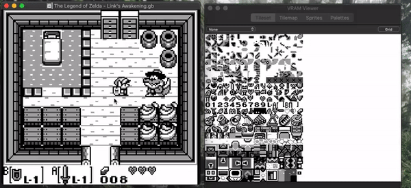
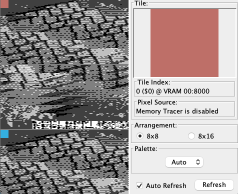
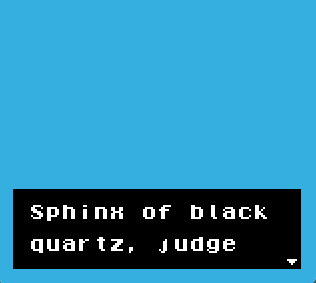
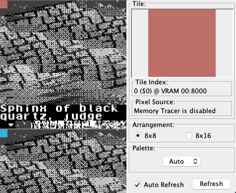
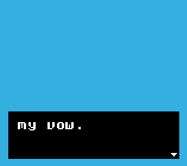
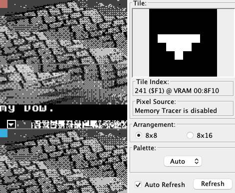

# Ejemplo de Sistema de Diálogo de Texto en GBDK-2020

**DESCARGO DE RESPONSABILIDAD: Esto es una prueba personal. Estoy aprendiendo y no soy un experto. ¡Este ejemplo, en su estado actual, no debería utilizarse en ningún proyecto real!** 

Una implementación experimental para mostrar texto sin cargar demasiados datos de sprites en la VRAM utilizando [GBDK-2020](https://github.com/Zal0/gbdk-2020). Se toma como ejemplo el sistema de diálogo de "The Legend of Zelda - Link's Awakening", donde el texto solo se carga en las direcciones desde `0xd0` hasta `0xef`.

El objetivo es crear una función que permita mostrar texto pasado a través de un método. El resultado debe lograr lo mismo que el sistema de diálogo de Link's Awakening.

## Cómo funciona

 1. Al iniciar, se mostrará una pantalla en blanco y la memoria se llenará con ruido aleatorio.

 2. Al presionar el **Botón A**, se cargará el texto y el cursor en las direcciones de memoria de `$D0` a `$F1` y se mostrarán en la _Window Layer_.

 

 3. Al presionar el **Botón A** nuevamente, se cargará la siguiente parte del texto en la memoria. Esto reemplazará el texto visible actualmente en la _Window Layer_. 

 

 - Al presionar el **Botón B**, se cancela el diálogo.

## Puntos Pendientes

 - Revisión / segunda opinión del código.
 - Crear una flecha parpadeante.
 - (Posiblemente) implementar una ventana de 'prompt' o 'elección'.

## Errores Conocidos

 - Cuando la cantidad de líneas es impar, la segunda línea muestra algo de ruido de VRAM.

## Contribuciones

Simplemente envía un Pull Request con una breve descripción de tus cambios y una explicación para que yo pueda aprender de ello. Gracias.
