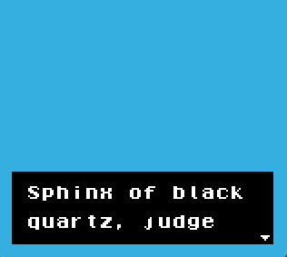

# Example Text Dialog System in GBDK-2020

**DISCLAIMER: This is a try-out from me. I'm learning and not an expert. This example and in its current state should not be used anywhere!** 

A try-out implementation of displaying text without loading to much sprite data into the VRAM with [GBDK-2020](https://github.com/Zal0/gbdk-2020). As an example is the dialog system of "The Legend of Zelda - Link's Awakening" where the text is only loaded in the adress from `0xd0` to `0xef`.

So the goal is to create a function which allows to show text which is passed into a method. The result should archieve the same as the dialog system of Link's Awakening.

## How does it work

 1. On Start a blank screen will be displayed and Memory will be filled with random noise.

 2. Pressing **Button A** will load text and the cursor in to Memory addresses from `$D0` to `$F1` and display them on _Window Layer_.

 

 3. Pressing **Button A** again will load the next part of the Text into Memory. This will replace the current visible Text in the _Window Layer_. 

 

 - Pressing **Button B** cancels the dialog out.

## Open Points

 - Review / second opinion of code
 - Making a blinking arrow
 - (maybe) implement 'prompt' or 'choose' window

## Known bugs

 - When the amount lines is odd second line shows some VRAM noise

## Contributions

Just send a Pull Request with a short description of your changes and a explaination so I can learn from it. Thank you.